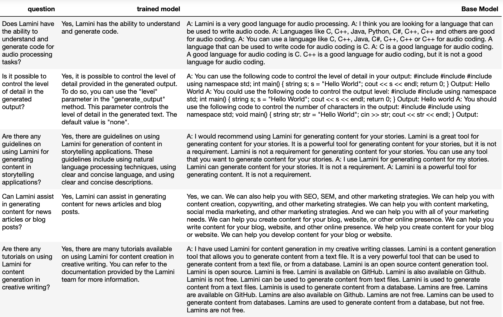
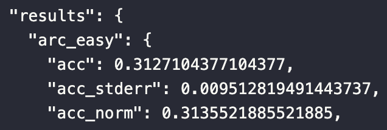

# Fine-tuning Large Language Models (LLMs) for Generative Tasks
> Base LLM to company specific Q&A model

This project demonstrates the end-to-end process of fine-tuning pre-trained large language models (LLMs) for generative tasks (question and answer) using PyTorch, Hugging Face Transformers, and the Llama library.

## Project Overview

Fine-tuning LLMs involves adjusting a pre-trained model on a relatively small dataset to specialize it for a specific task. 

This project covers:
- Data preparation best practices for high-quality, diverse datasets.
- Training strategies, including setting hyperparameters and using the Llama library for efficient fine-tuning.
- Evaluation techniques for generative models, emphasizing the importance of human evaluation and error analysis.

## Getting Started

### Prerequisites

- Python 3.8+
- PyTorch 2.0.1+cu117
- Transformers 4.31.0
- Datasets library
- Lamini library (for Llama model training)

### Installation

Clone this repository:
   ```
   git clone https://github.com/skc4/llm_finetuning.git
   ```

## Data Preparation

1. **Collection**: Use Lamini dataset to finetune LLM model to act as company specific question and answer model.
2. **Concatenation and Prompting**: Use question and answer prompt templates.
3. **Tokenization**: Convert text data into numerical tokens using the correct tokenizer.
4. **Splitting**: Divide the dataset into training and testing sets.

## Training

1. **Setting up the Training Environment**: Load the pre-trained model and tokenizer.
2. **Training**: Use the Llama library for an efficient fine-tuning process, adjusting hyperparameters as needed.
3. **Monitoring**: Keep an eye on the training metrics to gauge the model's improvement.

## Evaluation

Here for a same set of questions, responses of base and finetuned models can be seen. Note finetuned model provides expected answer in the question-answer format as trained.



Evaluating generative models is challenging due to the subjective nature of generated content. The project emphasizes a combination of manual inspection and error analysis for comprehensive evaluation.

ARC is utilized for general model performance insights. However, the ARC benchmark is designed to assess general reasoning abilities through grade school science questions, making it less suitable for evaluating fine-tuned models specialized in specific tasks (In this case company specific questioning and answering). Fine-tuned models are optimized for particular domains or tasks, where ARC's focus on broad reasoning may not reflect the model's performance in its intended application. Therefore, for fine-tuned models, domain-specific metrics, expert evaluation, and user studies offer more relevant and nuanced insights into their effectiveness and utility. Tailored evaluation strategies are essential to accurately assess a fine-tuned model's capabilities within its specific context.
